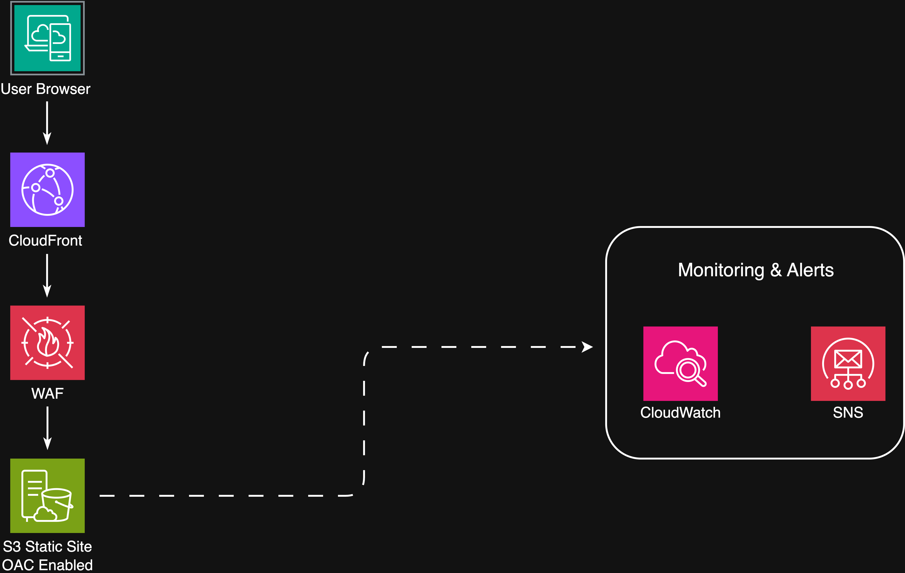
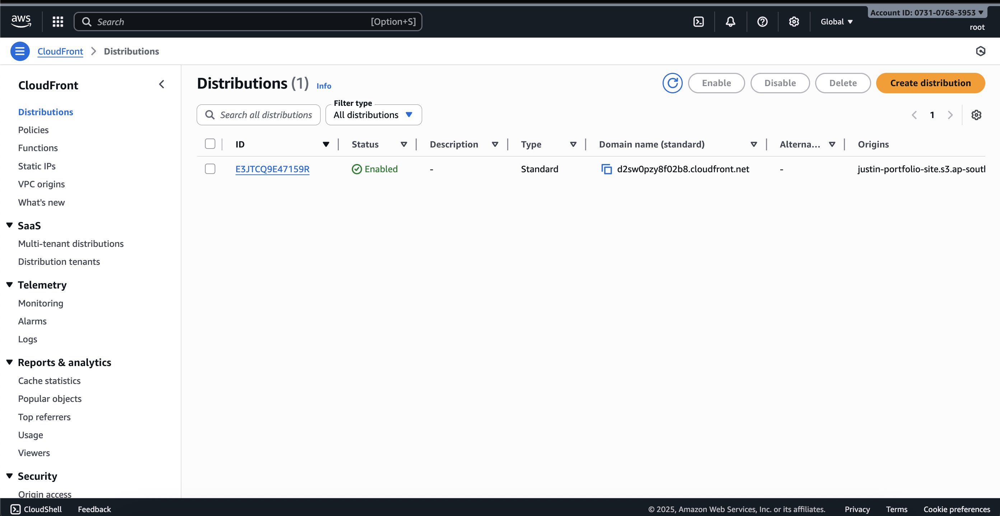
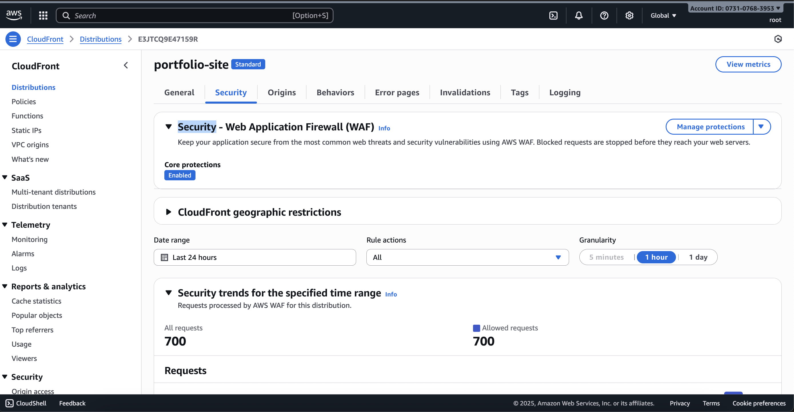
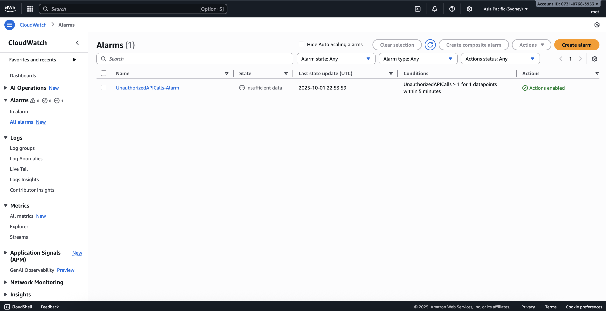
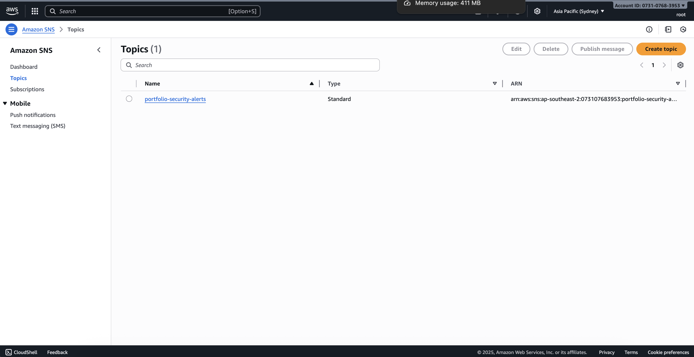
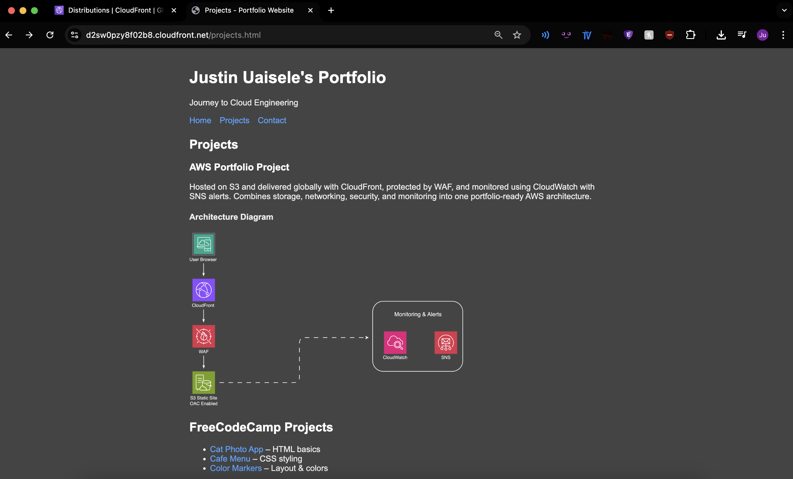

# AWS Portfolio Website Project  

This is my first attempt at setting up a portfolio site on AWS.
I kept it simple but added a few security features to learn the basics.

---

## What I used
- **S3** to host a static site  
- **CloudFront** to share it globally  
- **WAF** for basic protection  
- **CloudWatch** for monitoring and auto-response  

---

## Architecture Diagram

---

This is one of my early AWS projects. I wanted something I could show in my portfolio that uses storage, networking, monitoring, and security all together.  

---

## Proof of Deployment

- **S3 Bucket (Static Site Files)**  
  My static portfolio files stored in S3.  
  

- **CloudFront Distribution**  
  CloudFront serving my S3 bucket globally.  
  

- **WAF Protection Enabled**  
  Web Application Firewall attached to CloudFront.  
  

- **CloudWatch Alarm**  
  Alarm set up to trigger on unauthorized API calls.  
  

- **SNS Topic for Alerts**  
  SNS topic created to send notifications when alarms fire.  
  

- **Live Portfolio Site**  
  Portfolio site shared through CloudFront + WAF.  
  
