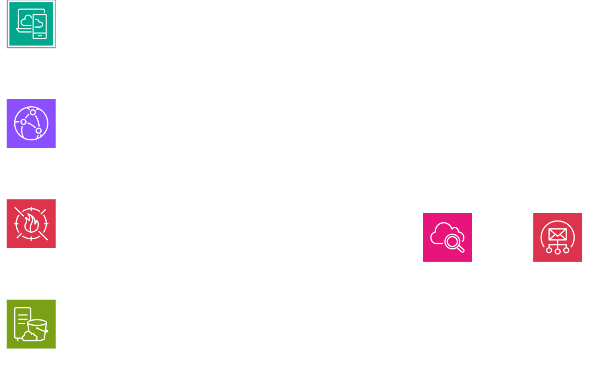

# AWS Portfolio Website Project  

This is my first attempt at setting up a portfolio site on AWS.
I kept it simple but added a few security features to learn the basics.

### What I used
- **S3** to host a static site  
- **CloudFront** to share it globally  
- **WAF** for basic protection  
- **VPC + EC2** for testing  
- **CloudWatch + Lambda** for monitoring and auto-response  

### Diagram

---

This is one of my early AWS projects. I wanted something I could show in my portfolio that uses storage, networking, monitoring, and security all together.  

---

📂 Files:  
- `diagram.png` (my diagram)  
