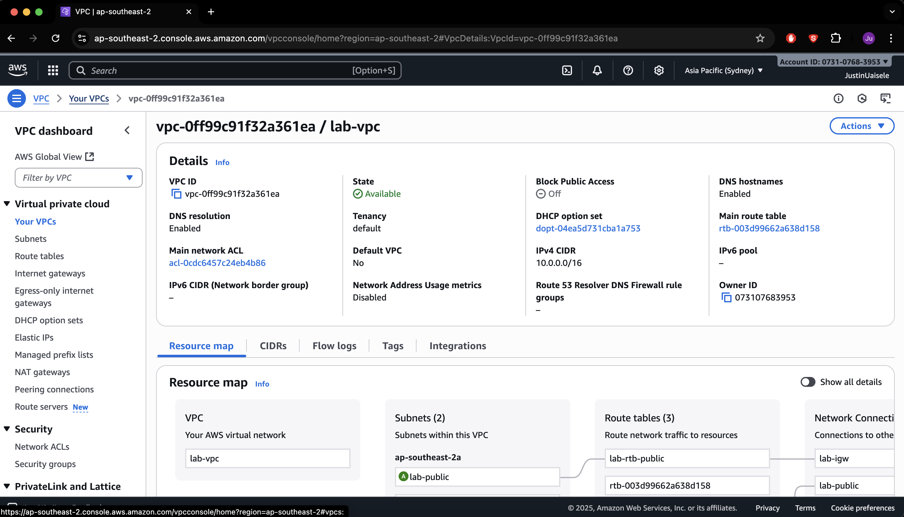
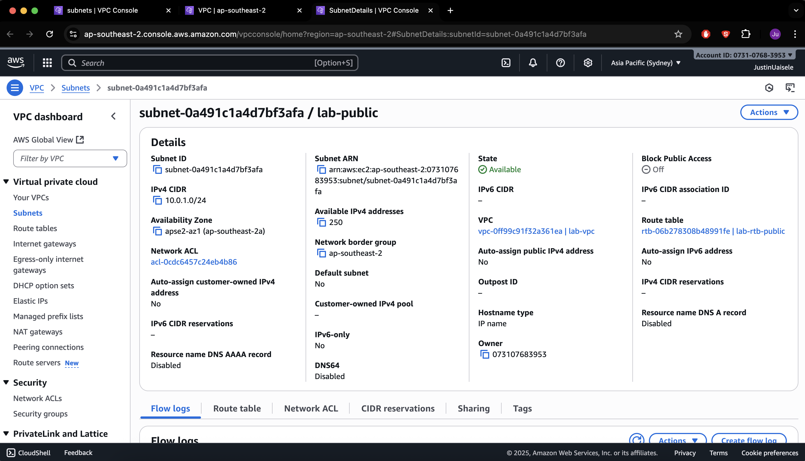
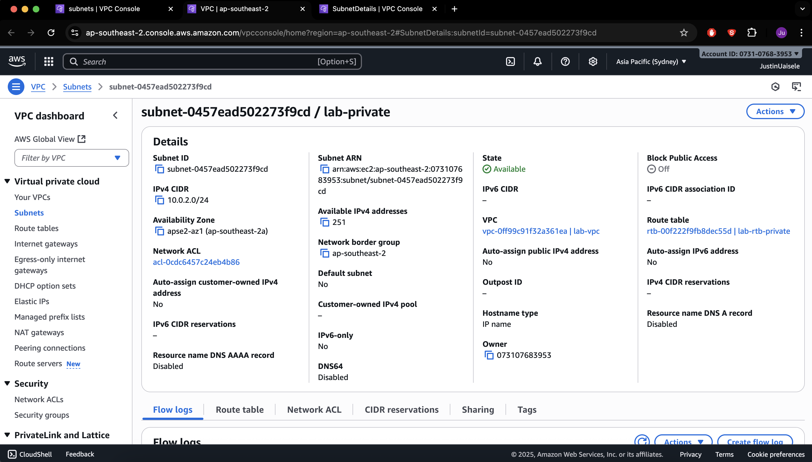
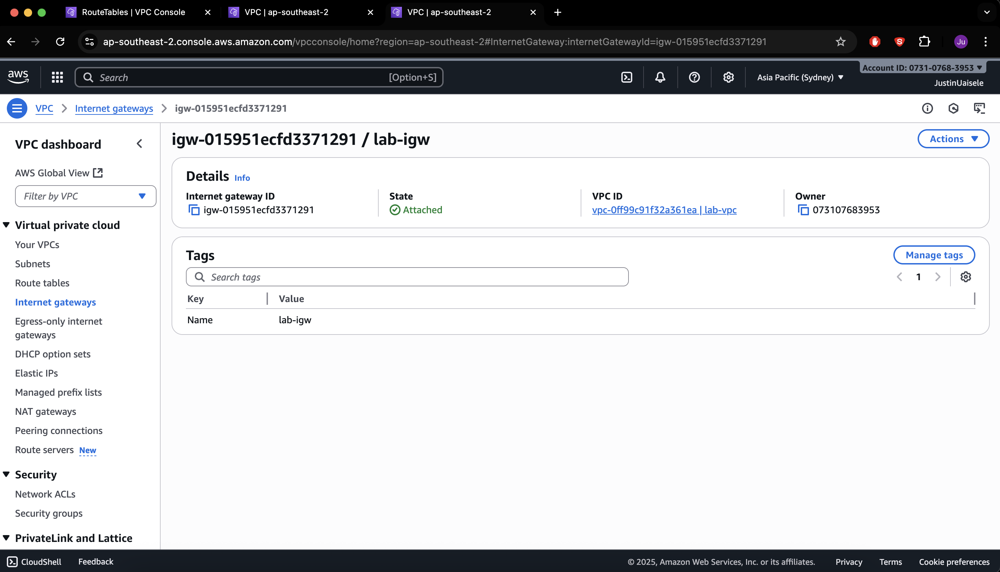
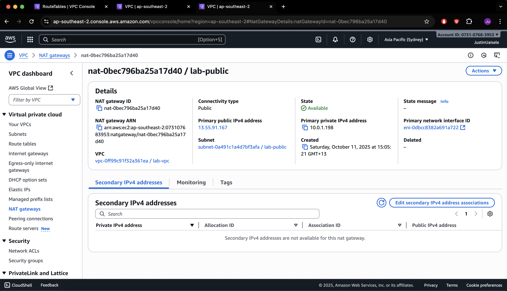
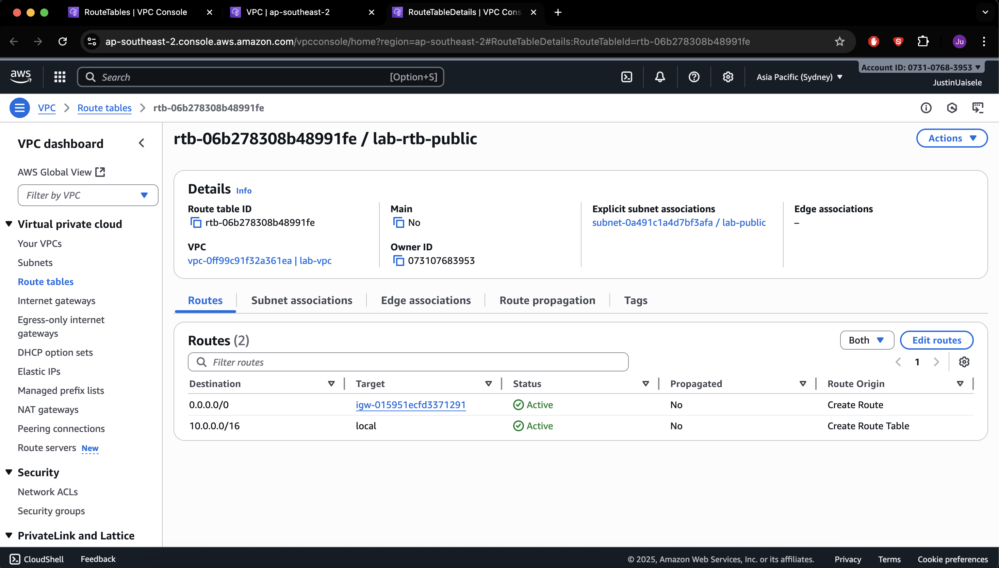
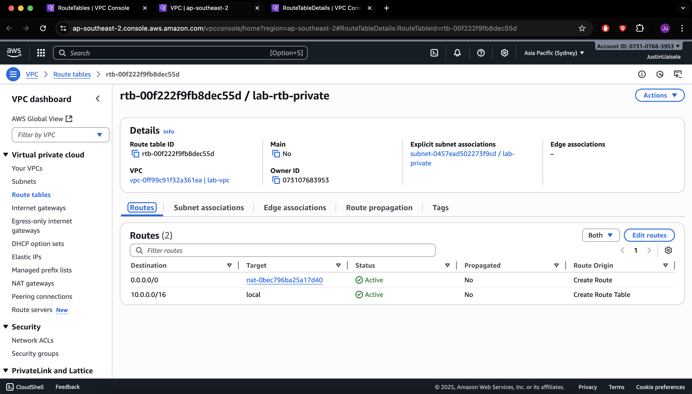
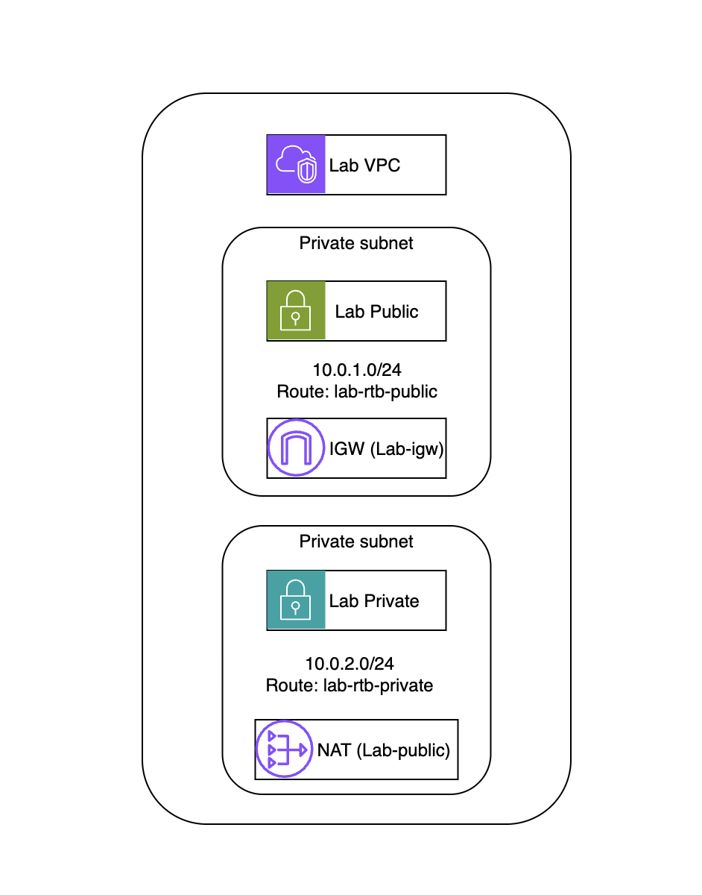

# AWS VPC + NAT Gateway (Phase 1)

This was my first proper AWS networking project.  
Last week I only had a static site running, so this time I wanted to build something more structured and understand how AWS networking actually works.

### What I was trying to do

I built a simple two-tier network:
- One public subnet for a web server
- One private subnet for a database
- An Internet Gateway so the public subnet can reach the internet
- A NAT Gateway so the private subnet can still get software updates

The main goal was to understand how routing and subnet isolation work, not to make a complex application.

### Network setup

VPC CIDR: 10.0.0.0/16  
Public Subnet: 10.0.1.0/24  
Private Subnet: 10.0.2.0/24

Resources I created:
- lab-vpc
- lab-igw (Internet Gateway)
- lab-nat (NAT Gateway with Elastic IP 13.55.91.167)
- lab-rtb-public → routes to IGW
- lab-rtb-private → routes to NAT Gateway
- lab-public subnet (for web)
- lab-private subnet (for database)

### What I got working

- VPC created successfully with both subnets active  
- Internet Gateway attached and routing correctly  
- NAT Gateway running in the public subnet with Elastic IP  
- Public route table points to IGW  
- Private route table points to NAT Gateway  
- Private subnet can access the internet through the NAT  
- Public subnet has normal inbound and outbound access  
- Took screenshots of each step for documentation

### Screenshots

**VPC Overview**

**Subnets**

**Gateways and Routing**

### Network Flow Diagram

### What I learned

- The Internet Gateway connects the VPC to the internet for public traffic.  
- The NAT Gateway allows outbound access only for private resources.  
- Route tables control exactly where traffic goes and which subnet uses which path.  
- Public and private subnets are separated by routing, not just names.  
- Seeing the routes and subnets connected correctly helped me understand AWS networking flow much better.

### Next up

In Phase 2, I’ll add:
- An EC2 web server in the public subnet  
- A database instance in the private subnet  
- Security groups to make sure only the web server can talk to the database  

This will complete the basic two-tier architecture.
