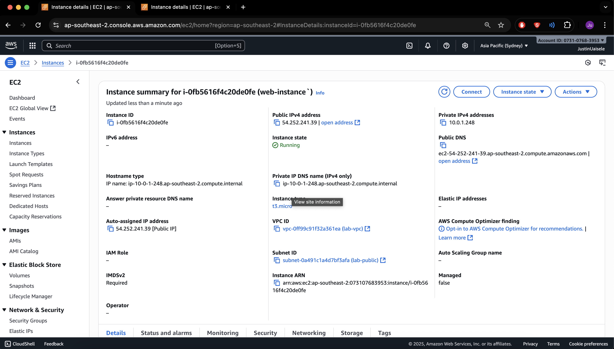
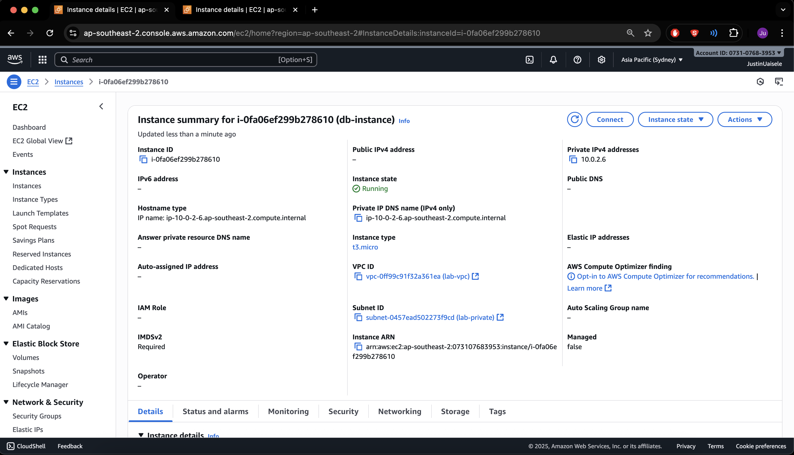
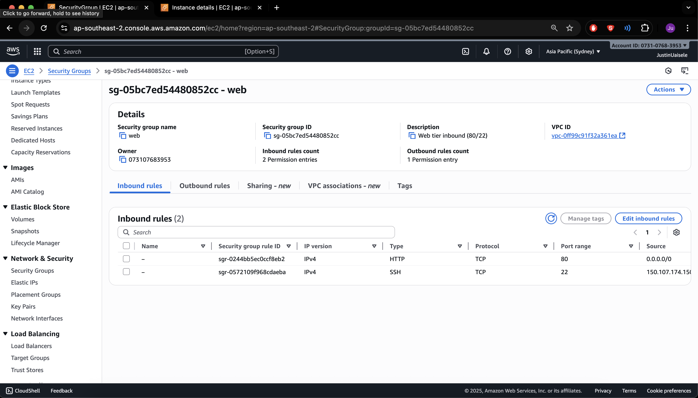
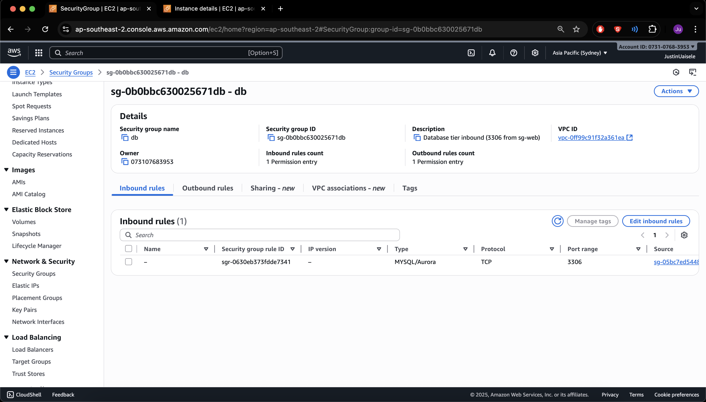
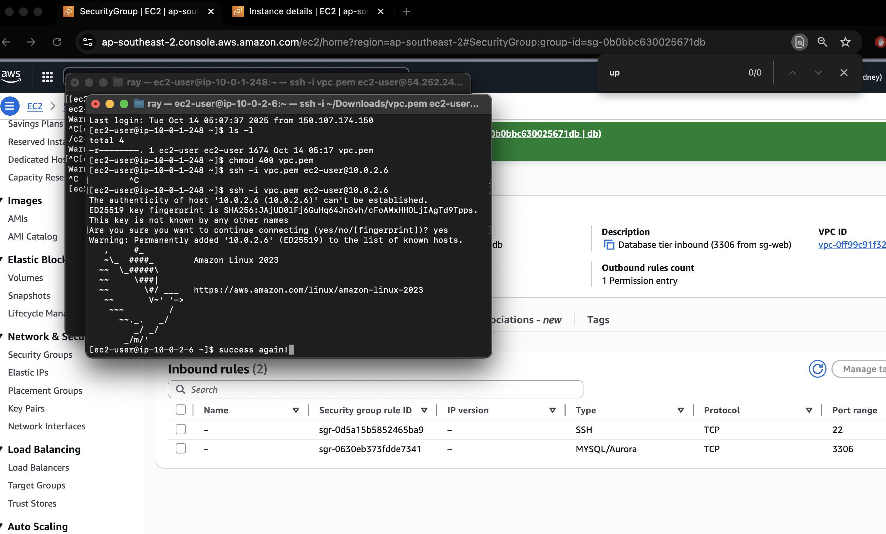
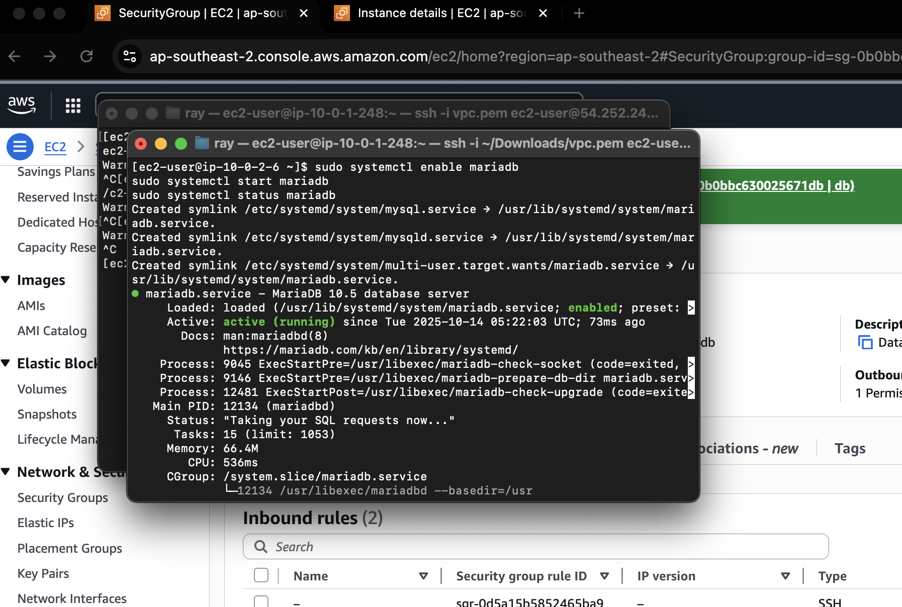

# AWS VPC Phase 2 — Web to DB Isolation

### Summary
In this phase I built on the first VPC setup and added a second instance to create a two-tier design.  
The goal was to have one web instance in the public subnet and one database instance in the private subnet.  
Only the web instance should talk to the database, and no one else should be able to reach it from the internet.  
I used Security Groups to control the traffic between the two.

---

### Evidence

| # | Description | Screenshot |
|:-:|:--|:--|
| 01 | Web instance running in the public subnet |  |
| 02 | Database instance running in the private subnet |  |
| 03 | Web security group inbound rules |  |
| 04 | Database security group inbound rule (3306 from web SG) |  |
| 05 | SSH connection from web to database (private access) |  |
| 06 | MariaDB service running and active |  |
| 07 | Port 3306 connection test successful |  |

---

### Reflection
This lab helped me understand how to isolate private resources in AWS.  
The database only accepts traffic from the web instance, not from the internet.  
It showed how security groups act like firewalls at the instance level.  
I also practiced testing network connections and checking service status through the terminal.

---

### Folder Info
Path: `week02-aws-vpc-securitygroups/security-groups/`  
Commit message: `Phase 2 - Web to DB Isolation proof`

---

### Next Steps
In the next phase I will rebuild this setup using Terraform to automate the network and instance creation.
