# AWS Secure Network Components — ALB + Bastion + Private Instance  
### Week 03 — Security+ 4.2 / Network Components Hardening

### Summary
This phase extended the previous two-tier (web → database) design into a secure three-tier network.  
The goal was to deploy an **Application Load Balancer (ALB)** and a **Bastion Host** to enforce segmented access between public and private resources.  
All traffic was restricted through chained Security Groups, and administrative access was managed with **AWS Systems Manager (SSM)** instead of SSH keys.

---

### Architecture Overview
- **VPC ID:** `vpc-0ff99c91f32a361ea`
- **Subnets**
  - `lab-public` → Bastion Host + ALB  
  - `lab-private` → Web Instance (private-web)
- **Routing**
  - Public RTB → Internet Gateway `igw-015951ecfd3371291`
  - Private RTB → Local routes only
- **Access Control**
  - Bastion SSH from my IP only (`/32`)
  - ALB open on port 80 to public
  - Private instance accepts HTTP from ALB SG and SSH from Bastion SG
- **Administration**
  - SSM Session Manager used for secure access (no key pair exposure)

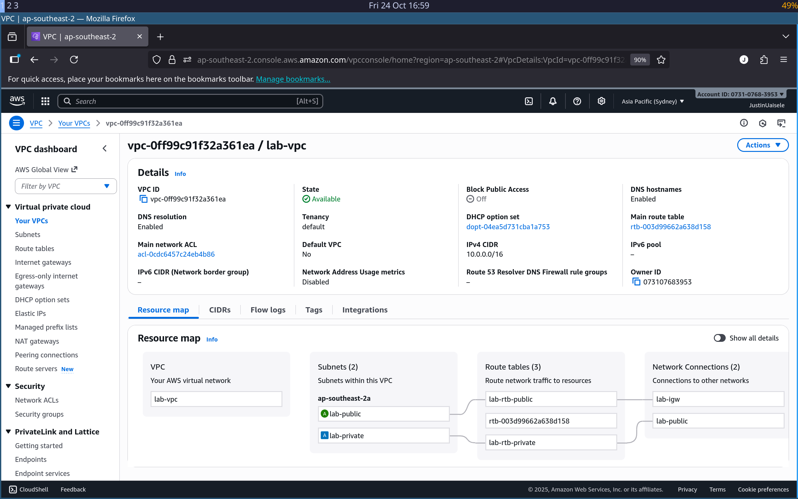

---

### Evidence

| # | Description | Screenshot |
|:-:|:--|:--|
| 01 | VPC routes showing IGW for public subnet and local for private | 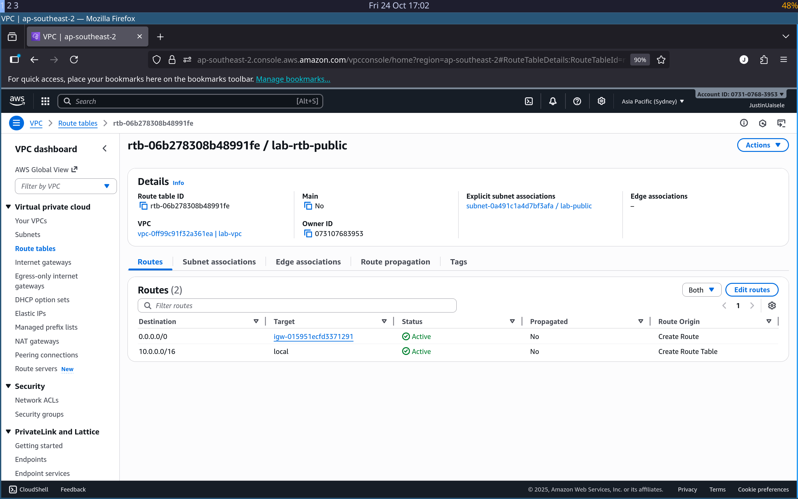 |
| 02 | Bastion host running in public subnet | 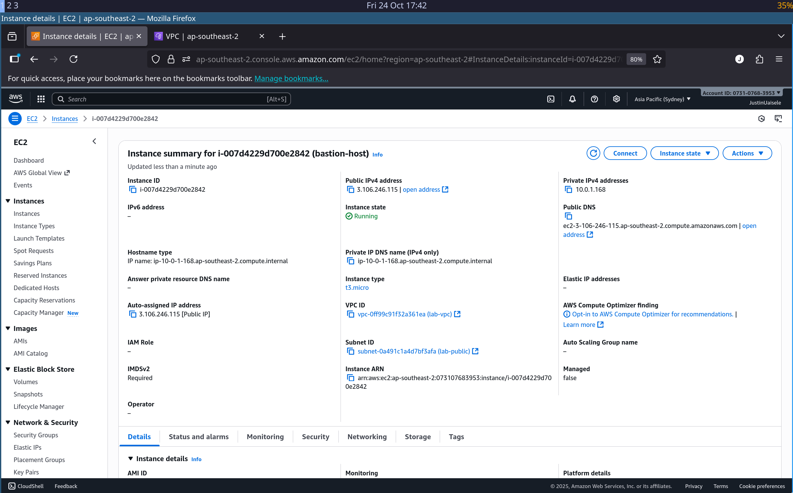 |
| 03 | Bastion security group restricts SSH to my IP only | 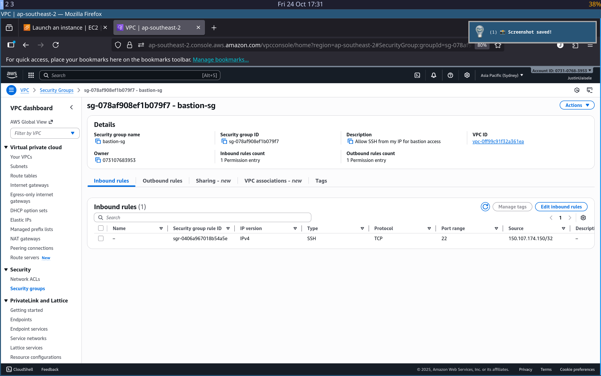 |
| 04 | Secure SSM session to bastion (no SSH keys) | 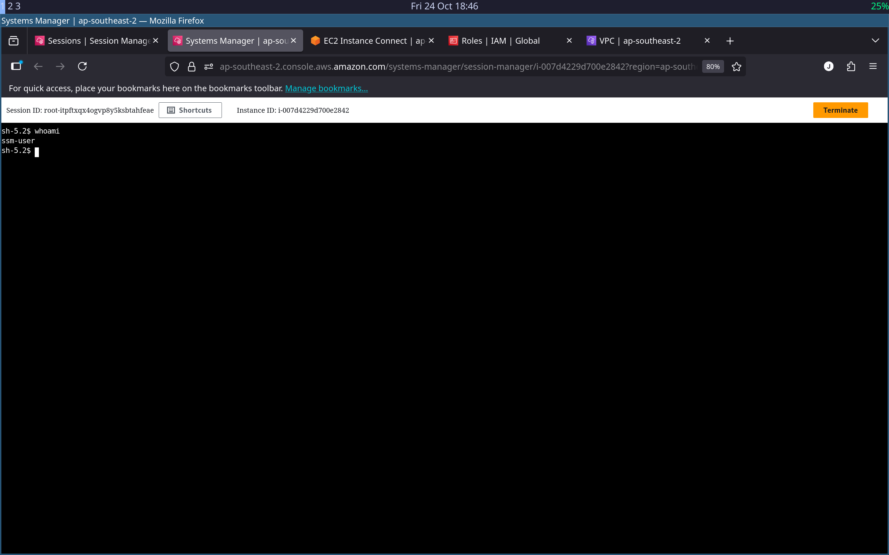 |
| 05 | Private web instance (no public IP) running in private subnet | 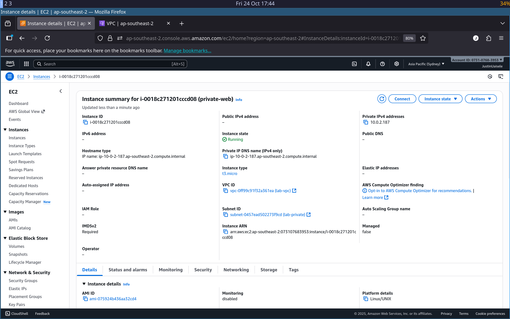 |
| 06 | Private SG allows HTTP from ALB and SSH from Bastion | 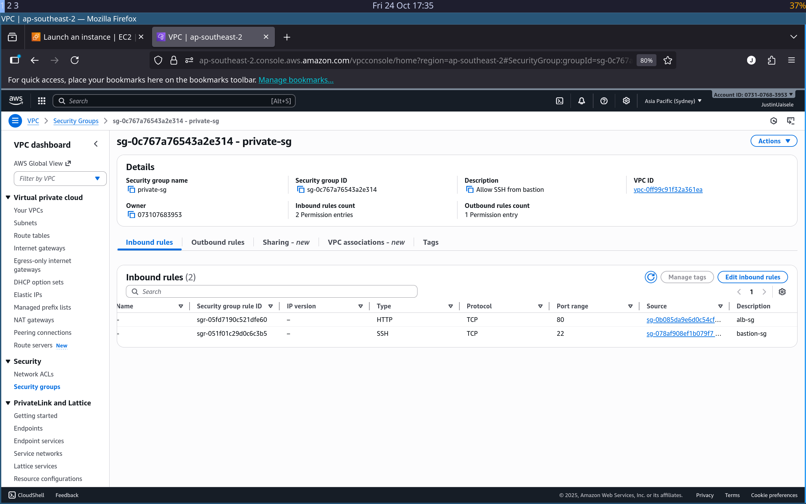 |
| 07 | Verified SSH chain (bastion → private EC2) and metadata access | 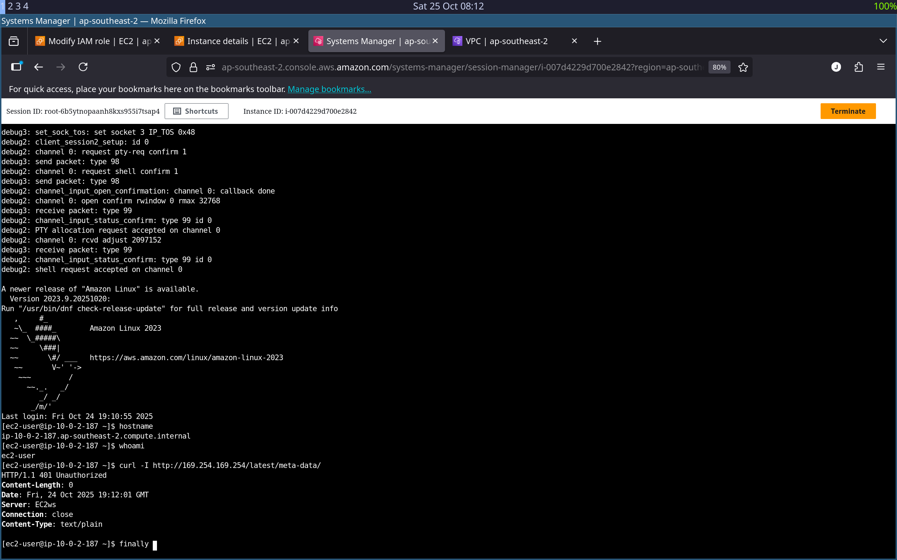 |
| 08 | ALB overview showing status Active and listener HTTP :80 | 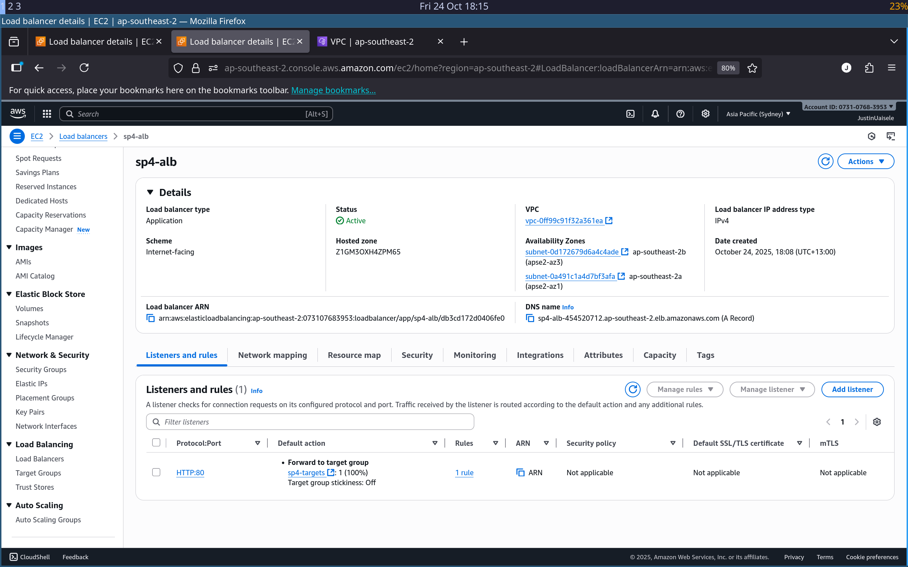 |
| 09 | ALB security group inbound rule allowing HTTP from internet | 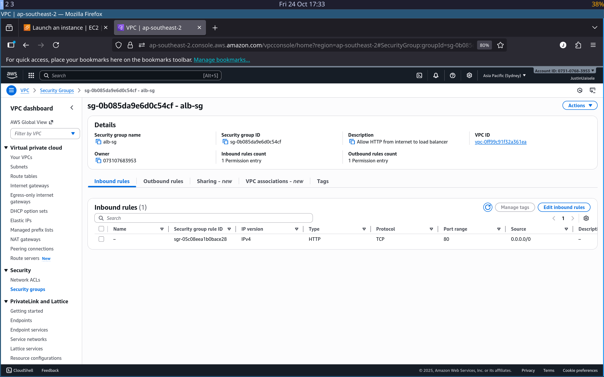 |
| 10 | Target group with healthy private instance registered | 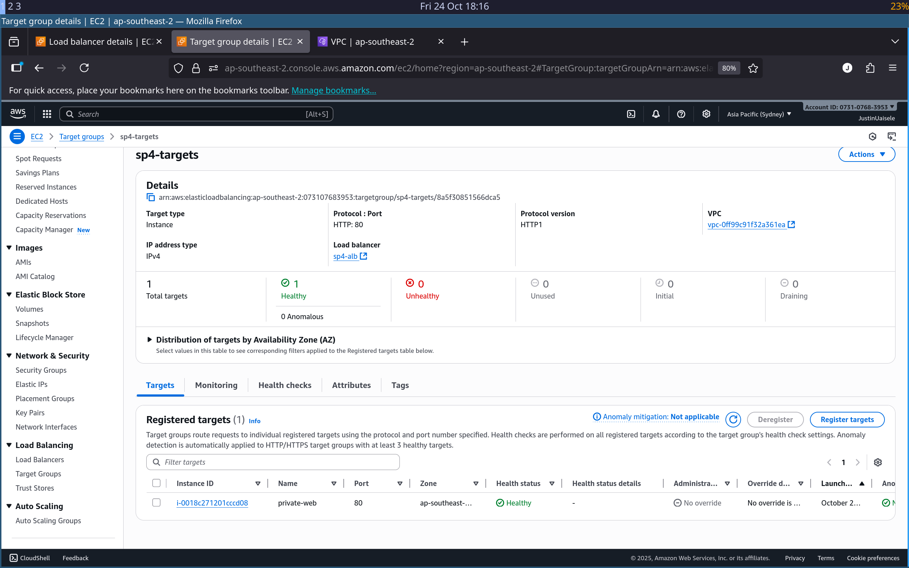 |
| 11 | HTTP test through ALB DNS endpoint returning 200 OK | 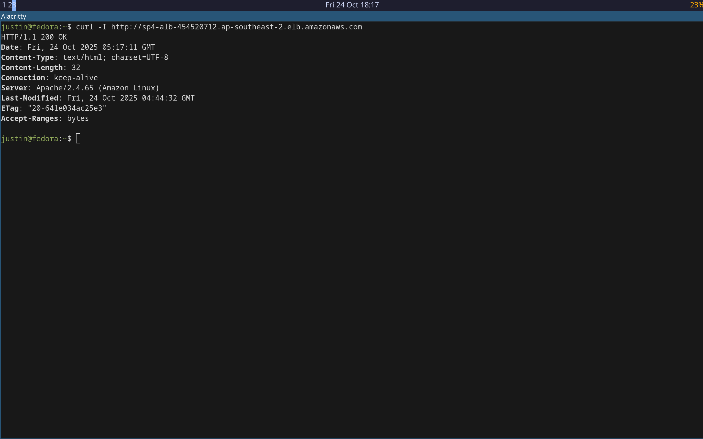 |

---

### Reflection
This lab completed the secure-access chain for a realistic cloud network.  
All management and application traffic is now segmented:
- Public users → ALB → Private EC2  
- Administrators → Bastion → Private EC2 (via SSM)

Using SSM instead of SSH keys eliminated key rotation risks.  
Security Groups and subnet boundaries worked together to enforce least-privilege access.  
The HTTP 200 response verified that ALB and target health checks were operating correctly.

---

### Next Steps
- Add HTTPS with ACM certificates and redirect rules.  
- Integrate CloudWatch alarms and WAF ACL for monitoring.  
- Automate deployment with Terraform and policy-as-code guardrails.  
- Extend IAM roles for EC2 and implement KMS for encryption in transit and at rest.

---

### Verification Summary

| Test | Command / Evidence | Result |
|:--|:--|:--|
| ALB Connectivity | `curl -I http://sp4-alb-454520712.ap-southeast-2.elb.amazonaws.com` | ✅ HTTP 200 OK |
| Bastion Access | SSM Session Manager login as `ssm-user` | ✅ Connected securely |
| Private Isolation | No public IP + SG restricted to ALB and Bastion | ✅ Verified |
| Target Health | ALB Target Group → Healthy | ✅ Verified |
| Routing | Public via IGW / Private local only | ✅ Verified |

---

### Outcome
A fully functional, secure three-tier VPC architecture demonstrating Network Segmentation, Zero Trust principles, and AWS native security best practices.  
This work aligns with **CompTIA Security+ Domain 4.2: Secure Network Components** and builds the foundation for Terraform and AWS Security Specialty automation labs.
