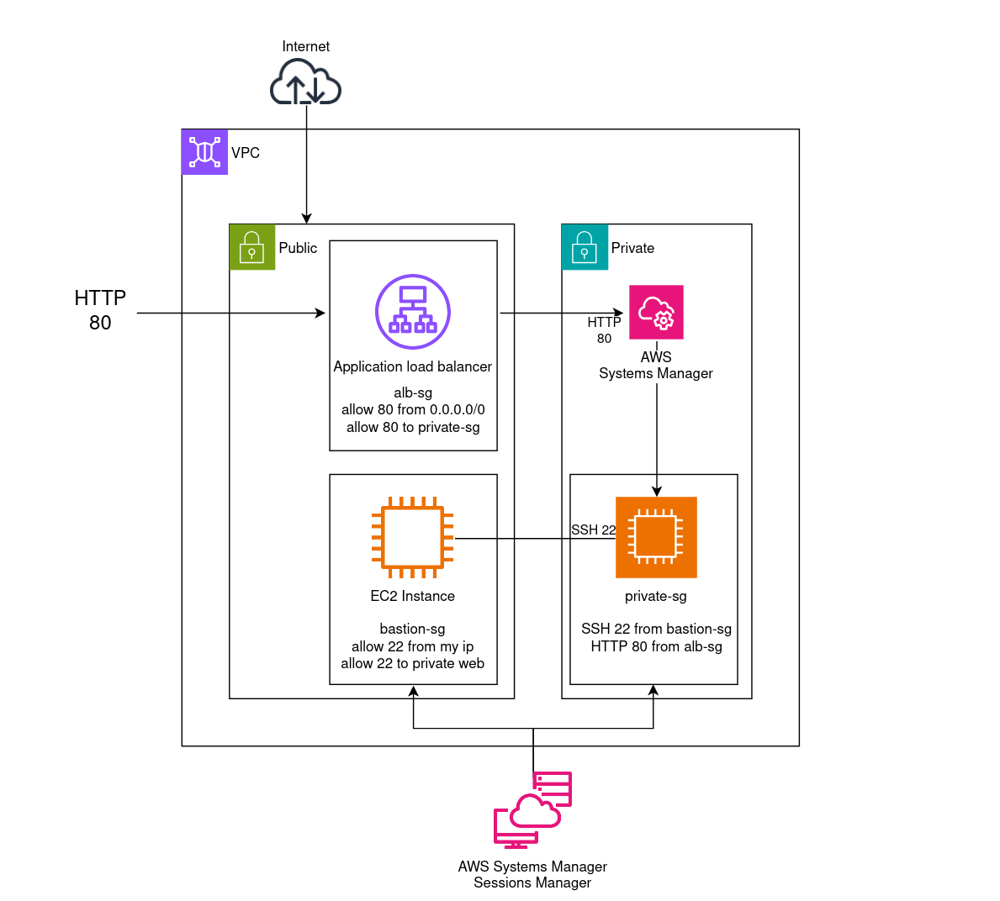

# AWS Secure Network Components / ALB + Bastion + Private Instance  
### Week 03 Security+ 4.2 / Network Components Hardening

### Summary
This week focused on building and securing a three-tier AWS network with an Application Load Balancer (ALB), a Bastion Host, and a private web instance.  
The goal was to connect everything through restricted Security Groups while testing real-world troubleshooting methods when SSH and SSM access failed.  
The process took several attempts to fix permissions, IAM roles, and instance states before achieving a full secure SSH chain and ALB response.

---

### Architecture Overview
- **VPC ID:** vpc-0ff99c91f32a361ea
- **Subnets**
  - lab-public → Bastion Host + ALB  
  - lab-private → Web Instance (private-web)
- **Routing**
  - Public RTB → Internet Gateway igw-015951ecfd3371291  
  - Private RTB → Local routes only
- **Access Control**
  - Bastion SSH from my IP only (/32)
  - ALB open on port 80 to public
  - Private instance accepts HTTP from ALB SG and SSH from Bastion SG
- **Administration**
  - Used SSM Session Manager for access instead of permanent SSH keys  
  - Temporary key was injected through AWS CLI to restore access when locked out

---

### Network Diagram

  

*Three-tier AWS network with ALB, Bastion Host, Private EC2, and SSM integration. (tried my best haha)*

---

### Troubleshooting Notes
I ran into several issues before everything worked correctly:
- At first, I kept getting `Permission denied (publickey)` when trying to SSH from the bastion.  
- The IAM role for SSM didn’t have `AmazonSSMManagedInstanceCore`, so all `send-command` attempts failed.  
- I had to stop the private instance with `--force` when it got stuck in the `stopping` state.  
- After attaching the right IAM policy, I used `aws ssm send-command` to inject a temporary key into `/home/ec2-user/.ssh/authorized_keys`.  
- The permissions had to be fixed with `chmod 600` and ownership with `chown ec2-user:ec2-user`.  
- Once that was done, SSH finally worked through the bastion to the private instance.  

The hardest part was keeping track of which security group was allowing what traffic. The private instance needed SSH allowed **from the bastion’s security group**, not my IP.

---

### Evidence

| # | Description | Screenshot |
|:-:|:--|:--|
| 01 | VPC routes showing IGW for public subnet and local for private |  |
| 02 | Bastion host running in public subnet |  |
| 03 | Bastion security group restricted to my IP |  |
| 04 | SSM session to bastion (used during recovery) |  |
| 05 | Private instance with no public IP |  |
| 06 | Private SG allowing SSH from Bastion SG and HTTP from ALB |  |
| 07 | Verified SSH chain from bastion to private instance |  |
| 08 | ALB status active and listener running on port 80 |  |
| 09 | ALB inbound rule allowing HTTP from the internet |  |
| 10 | Target group showing healthy registered instance |  |
| 11 | HTTP 200 test through ALB DNS endpoint |  |

---

### Reflection
This was the most difficult lab so far because of the number of moving parts and how small mistakes in security groups or IAM roles broke the chain.  
It taught me how to use SSM and CLI to fix locked-out instances safely and confirmed how security layering really works in AWS.  
After fixing permissions, reattaching the right IAM role, and confirming SG relationships, I was able to verify a successful connection and HTTP 200 from the ALB.

---

### Next Steps
- Add HTTPS with ACM certificates.  
- Configure CloudWatch monitoring and WAF.  
- Automate the setup using Terraform.  
- Test KMS encryption and IAM least privilege in the next stage.

---

### Verification Summary

| Test | Command / Evidence | Result |
|:--|:--|:--|
| ALB Connectivity | curl -I http://sp4-alb-454520712.ap-southeast-2.elb.amazonaws.com | HTTP 200 OK |
| Bastion Access | SSM Session Manager login as ssm-user | Connected securely |
| Private Isolation | No public IP and SG only allows ALB and Bastion | Verified |
| Target Health | ALB Target Group healthy | Verified |
| Routing | Public via IGW and Private local only | Verified |

---

### Outcome
A working three-tier architecture that uses ALB for public traffic, a Bastion for controlled admin access, and SSM for secure management.  
The troubleshooting and recovery steps were real challenging, but represented real-world scenarios and helped reinforce secure network design.
